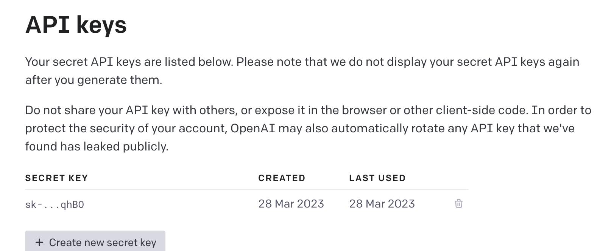

# Getting Started Guide

## Prerequisites

1. Ensure `k8sgpt` is installed correctly on your environment by following the [installation](./installation.md).
2. You need to be connected to any Kubernetes cluster.

### Setting up a Kubernetes cluster

To give `k8sgpt` a try, set up a basic Kubernetes cluster, such as KinD or Minikube (if you are not connected to any other cluster).

!!! tip
    Please only use K8sGPT on environments where you are authorized to modify Kubernetes resources.

- The [KinD documentation](https://kind.sigs.k8s.io/docs/user/quick-start/) provides several installation options to set up a local cluster with two commands.

- The [Minikube documentation](https://minikube.sigs.k8s.io/docs/start/) covers different Operative Systems and Architectures to set up a local Kubernetes cluster running on a Container or Virtual Machine.

## Using K8sGPT

You can view the different command options through 

```bash
k8sgpt --help

Kubernetes debugging powered by AI

Usage:
  k8sgpt [command]

Available Commands:
  analyze     This command will find problems within your Kubernetes cluster
  auth        Authenticate with your chosen backend
  completion  Generate the autocompletion script for the specified shell
  filters     Manage filters for analyzing Kubernetes resources
  generate    Generate Key for your chosen backend (opens browser)
  help        Help about any command
  integration Intergrate another tool into K8sGPT
  serve       Runs k8sgpt as a server
  version     Print the version number of k8sgpt

Flags:
      --config string        config file (default is $HOME/.k8sgpt.yaml)
  -h, --help                 help for k8sgpt
      --kubeconfig string    Path to a kubeconfig. Only required if out-of-cluster.
      --kubecontext string   Kubernetes context to use. Only required if out-of-cluster.

Use "k8sgpt [command] --help" for more information about a command.
```

## Authenticate with OpenAI

First, you will need to authenticate with your chosen backend. The backend is the AI provider such as OpenAI's ChatGPT.

[Ensure that you have created an account.](https://chat.openai.com/auth/login)

Next, generate a token from the backend:

```bash
k8sgpt generate
```

This will provide you with a URL to generate a token, follow the URL from the command line to your browser to then generate the token.



Copy the token for the next step.

Then, authenticate with the following command:

```bash
k8sgpt auth new
```

This will request the token that has just been generated. Paste the token into the command line.

You should then see the following success message:
> Enter openai Key: openai added to the AI backend provider list

## Analyze your cluster

Ensure that you are connected the correct Kubernetes cluster, for this initial example is preferable to use KinD or Minikube as discussed earlier.

```bash
kubectl config current-context
```

```bash
kubectl get nodes
```

We will new create a new "broken Pod", simply create a new YAML file named `broken-pod.yml` with the following contents:
```yaml
apiVersion: v1
kind: Pod
metadata:
  name: broken-pod
  namespace: default
spec:
  containers:
    - name: broken-pod
      image: nginx:1.a.b.c
      livenessProbe:
        httpGet:
          path: /
          port: 81
        initialDelaySeconds: 3
        periodSeconds: 3
```
You might have noticed, this Pod has a wrong image tag. This is ok for this example, we simply want to have an issue in our cluster. The simply run:

```bash
kubectl apply -f broken-pod.yml
```

This will create the "broken Pod" in the cluster. You can verify this by running:

```bash
kubectl get pods

NAME         READY   STATUS         RESTARTS   AGE
broken-pod   0/1     ErrImagePull   0          5s
```

Now, you can go ahead and analyse your cluster:

```bash
k8sgpt analyze
```

Executing this command will generate a list of issues present in your Kubernetes cluster. In the case of our example, a message should be displayed highlighting the problem related to the container image.

```bash
0 default/broken-pod(broken-pod)
- Error: Back-off pulling image "nginx:1.a.b.c"
```

!!! info
    To become acquainted with the available flags supported by the `analyse` command, type `k8sgpt analyse -h` for more information. This will provide you with a comprehensive list of all the flags that can be utilized.

For a more engaging experience and a better understanding of the capabilities of `k8sgpt` and LLMs (Large Language Models), run the following command:

```bash
k8sgpt analyse --explain
```

Congratulations! you have successfully created a local kubernetes cluster, deployed a "broken Pod" and analyzed it using `k8sgpt`.
