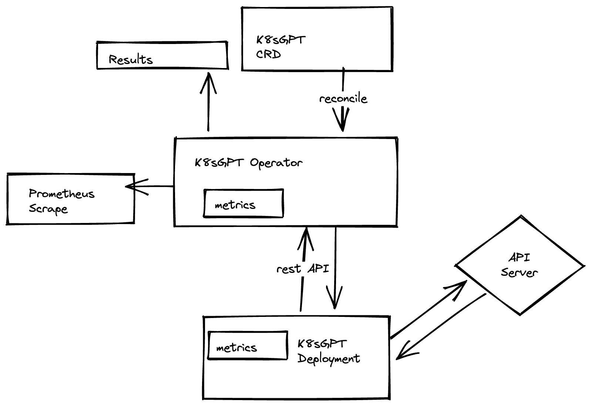

# K8sGPT Operator

K8sGPT can run as a Kubernetes Operator inside the cluster.
The scan results are provided as Kubernetes YAML manifests.

This section will only detail how to configure the operator. For installation instructions, please see the [getting-started section.](../../getting-started/in-cluster-operator.md)

## Architecture

The diagram below showcases the different components that the K8sGPT Operator installs and manages:



## Customising the Operator

As with other Helm Charts, the K8sGPT Operator can be customised by modifying  the [ `values.yaml`](https://github.com/k8sgpt-ai/k8sgpt/blob/main/charts/k8sgpt/values.yaml) file.

The following fields can be customised in the Helm Chart Deployment:


| Parameter                | Description             | Default        |
| ------------------------ | ----------------------- | -------------- |
| `serviceMonitor.enabled` |  | `false` |
| `serviceMonitor.additionalLabels` |  | `{}` |
| `grafanaDashboard.enabled` |  | `false` |
| `grafanaDashboard.folder.annotation` |  | `"grafana_folder"` |
| `grafanaDashboard.folder.name` |  | `"ai"` |
| `grafanaDashboard.label.key` |  | `"grafana_dashboard"` |
| `grafanaDashboard.label.value` |  | `"1"` |
| `controllerManager.kubeRbacProxy.containerSecurityContext.allowPrivilegeEscalation` |  | `false` |
| `controllerManager.kubeRbacProxy.containerSecurityContext.capabilities.drop` |  | `["ALL"]` |
| `controllerManager.kubeRbacProxy.image.repository` |  | `"gcr.io/kubebuilder/kube-rbac-proxy"` |
| `controllerManager.kubeRbacProxy.image.tag` |  | `"v0.0.19"` |
| `controllerManager.kubeRbacProxy.resources.limits.cpu` |  | `"500m"` |
| `controllerManager.kubeRbacProxy.resources.limits.memory` |  | `"128Mi"` |
| `controllerManager.kubeRbacProxy.resources.requests.cpu` |  | `"5m"` |
| `controllerManager.kubeRbacProxy.resources.requests.memory` |  | `"64Mi"` |
| `controllerManager.manager.sinkWebhookTimeout` |  | `"30s"` |
| `controllerManager.manager.containerSecurityContext.allowPrivilegeEscalation` |  | `false` |
| `controllerManager.manager.containerSecurityContext.capabilities.drop` |  | `["ALL"]` |
| `controllerManager.manager.image.repository` |  | `"ghcr.io/k8sgpt-ai/k8sgpt-operator"` |
| `controllerManager.manager.image.tag` | | `"v0.0.19"` |
| `controllerManager.manager.resources.limits.cpu` |  | `"500m"` |
| `controllerManager.manager.resources.limits.memory` |  | `"128Mi"` |
| `controllerManager.manager.resources.requests.cpu` |  | `"10m"` |
| `controllerManager.manager.resources.requests.memory` |  | `"64Mi"` |
| `controllerManager.replicas` |  | `1` |
| `kubernetesClusterDomain` |  | `"cluster.local"` |
| `metricsService.ports` |  | `[{"name": "https", "port": 8443, "protocol": "TCP", "targetPort": "https"}]` |
| `metricsService.type` |  | `"ClusterIP"` |

### For example: In-cluster metrics

It is possible to enable metrics of the operator so that they can be scraped through Prometheus.

This is the configuration required in the `values.yaml` manifest:
```yaml
serviceMonitor:
  enabled: true
```

The new `values.yaml` manifest can then be provided upon installing the Operator inside the cluster:
```bash
helm install release k8sgpt/k8sgpt-operator --values values.yaml
```
